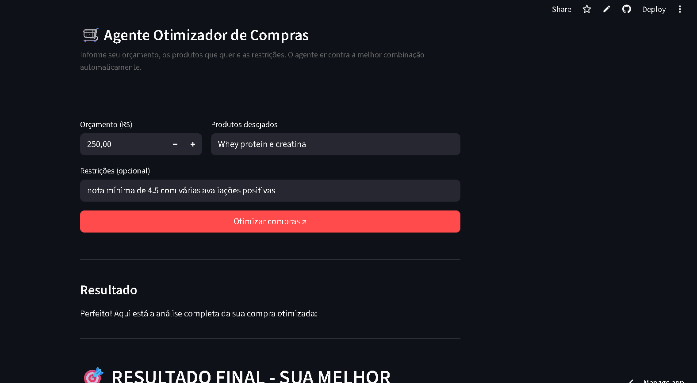
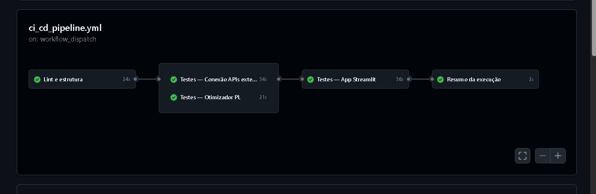

# 🛒 Agente Otimizador de Compras

Agente de IA que busca produtos em múltiplos marketplaces, aplica filtros personalizados e encontra a melhor combinação de compras dentro do seu orçamento; Você pode usar linguagem natural a vontade para dizer seu orçamento e quais produtos quer. 

[](https://claudesalesassistant-us4bzwk6jrpqmxf5fmzmmz.streamlit.app/)

---

## ✨ Funcionalidades

- Busca simultânea em **Amazon**, **eBay** e **AliExpress**
- Otimização da combinação de produtos via **Programação Linear**
- Filtros por avaliação mínima, preço máximo por item e marcas excluídas
- Análise de reviews reais com classificação de sentimento
- Interface conversacional em linguagem natural via Streamlit

---

## 🗂️ Estrutura do projeto

```
projeto_agente_claude/
├── .github/
│   └── workflows/
│       └── ci_cd_pipeline.yml   # CI/CD — lint, testes unitários e de API
├── agent/
│   ├── agente.py                # Loop principal do agente (Anthropic API)
│   └── tools_schema.py          # Definição das tools para o modelo
├── tools/
│   ├── busca.py                 # Integração Amazon, eBay e AliExpress
│   ├── otimizador.py            # Filtros e otimização via PL
│   └── teste_busca.py           # Testes manuais de busca
├── app.py                       # Interface Streamlit
├── main.py                      # Entrada via terminal
└── requirements.txt
```

---

## 🤖 Tools do Agente

O agente opera num loop autônomo chamando as seguintes tools:

### `buscar_produtos`
Realiza busca simultânea em Amazon, eBay e AliExpress e agrega os resultados em uma lista unificada com título, preço, avaliação, número de avaliações, link e marketplace de origem.

### `aplicar_filtros`
Filtra a lista de produtos com base nas restrições informadas pelo usuário:
- `avaliacao_minima` — exclui produtos abaixo de uma nota mínima
- `preco_maximo_por_item` — exclui produtos acima de um teto de preço
- `marcas_excluidas` — remove marcas indesejadas

### `otimizar_compras`
Resolve um problema de **Programação Linear (PL)** para encontrar a combinação ótima de produtos dado:
- Um **orçamento total** como restrição hard
- Uma **categoria por produto** — garante que exatamente um item de cada categoria seja selecionado
- A **função objetivo** maximiza a relação custo-benefício ponderando avaliação e volume de reviews, priorizando os produtos mais bem avaliados com maior número de opiniões dentro do orçamento disponível

Retorna os produtos selecionados, o total gasto e o saldo restante. Em caso de orçamento insuficiente ou lista vazia, retorna uma mensagem de erro descritiva.

### `buscar_reviews`
Busca reviews reais de um produto na Amazon via ASIN. Retorna sentimento geral (escala de *Muito negativo* a *Muito positivo*), média das notas, melhor comentário positivo e melhor comentário negativo com autor e data.

---

## 🚀 Como usar

### Online

Acesse diretamente o app em produção:
**[claudesalesassistant-us4bzwk6jrpqmxf5fmzmmz.streamlit.app](https://claudesalesassistant-us4bzwk6jrpqmxf5fmzmmz.streamlit.app/)**

### Localmente

```bash
# 1. Clone o repositório
git clone https://github.com/seu-usuario/seu-repo.git
cd seu-repo

# 2. Crie e ative o ambiente virtual
python -m venv venv
source venv/bin/activate  # Windows: venv\Scripts\activate

# 3. Instale as dependências
pip install -r requirements.txt

# 4. Execute o app
streamlit run app.py

# Ou via terminal
python main.py
```

---

## 🧪 CI/CD

O pipeline de testes roda via GitHub Actions com dispatch manual.

| Job | O que testa |
|-----|-------------|
| `lint` | Estrutura de arquivos obrigatórios + flake8 |
| `testes-otimizador` | Funções `aplicar_filtros` e `otimizar_compras` |
| `testes-apis` | Conexão com Anthropic API, Amazon, eBay e AliExpress |
| `teste-streamlit` | Sintaxe do `app.py` + health check do servidor |

Para rodar: **Actions → CI/CD — Testes e Validação → Run workflow**

---

## 📸 Screenshots

### App




### CI/CD



---

## 🛠️ Tecnologias

- [Python 3.11](https://www.python.org/)
- [Anthropic API](https://www.anthropic.com/) — modelo `claude-haiku-4-5`
- [Streamlit](https://streamlit.io/) — interface web
- [RapidAPI](https://rapidapi.com/) — Amazon, eBay e AliExpress
- [GitHub Actions](https://github.com/features/actions) — CI/CD


